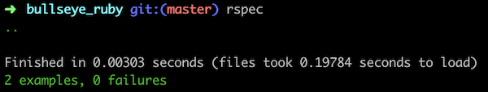

# bullseye_ruby

## GitHub repository: https://github.com/r-craig73/bullseye_ruby

#### By Ron Craig (https://github.com/r-craig73)

## Description
#### Personal project: Create a method that allows a user selects a number of targets (targets), a nested array of x,y positions [[3, 4], [2, -2], [-2, 5]] (positions), and requested positions that are closest to the bullseye target (0,0) (closest_darts).

#### Bullseye specs
1. The method returns the closest dart position to the bullseye
  * inputs: board = Board.new(3, [[3, 4], [2, -2], [1, 2]], 1)
  * output: expect(board.bullseye).to(eq([1, 2]))
2. The method returns multiple positions that are closest to the bullseye (closest first, 2nd closest second, etc.)
  * inputs: board = Board.new(3, [[3, 4], [2, -2], [1, 2]], 2)
  * output: expect(bullseye).to(eq([[1, 2], [2, -2]]))

### Rspec results

## Setup/Installation Requirements
### Clone repository.
### Install Ruby and Gems
* `$ gem install rspec`
* `$ gem install pry`
* `$ bundle install`

### Run rspec in the terminal's home directory path
* `bullseye_ruby $ rspec`

## Technologies Used
* Ruby
* Ruby script
* Ruby Gems

## Support and contact details
_Please contact ron.craig@comcast.net with questions._

## MIT License